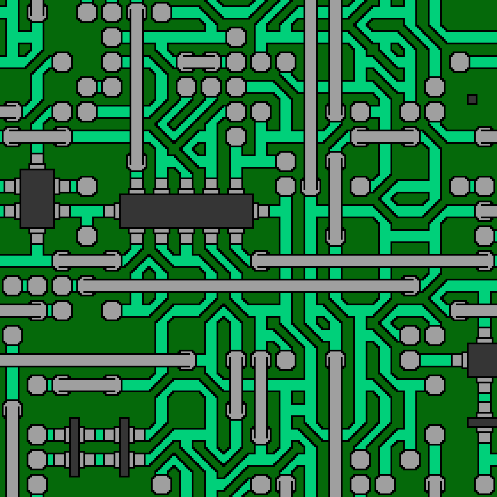
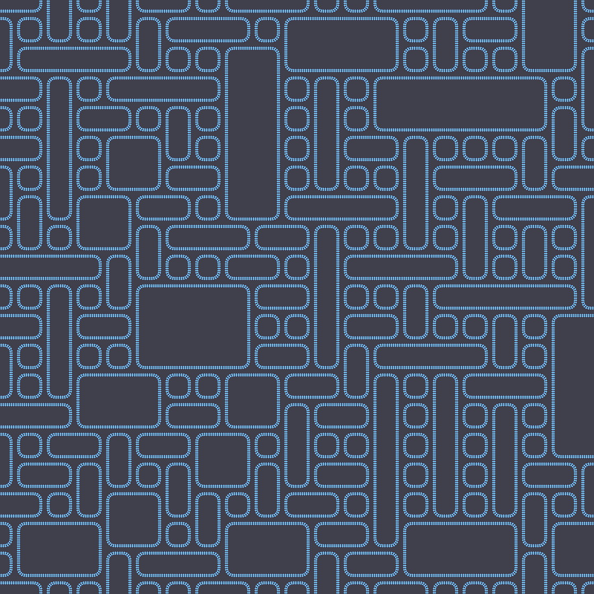

# Wave Function Collapse

This is a simple implementation of the Wave Function Collapse algoritm using tiles.

The input images must be named `{id}_{constraints}.png` where:
* `id` is a unique string identifier accross the images
* `constraints` is the concatenation of `up`, `right`, `bottom`, and `left` constraints
    * Each of these constraints is string of the size you desire, as long as all 4 constraints have the same size. Therefore, `len(constraints) % 4 == 0`.
    * These constraints will act as sockets to decide which tile can be plugged on each side of some tile

# Sample Output

## Circuit

### Input

### Output

## Tracks

### Input

### Output

